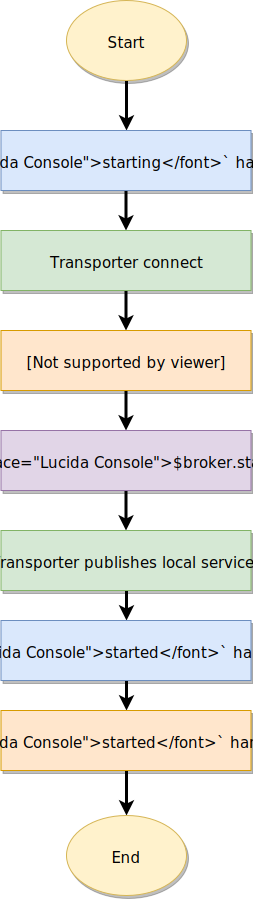
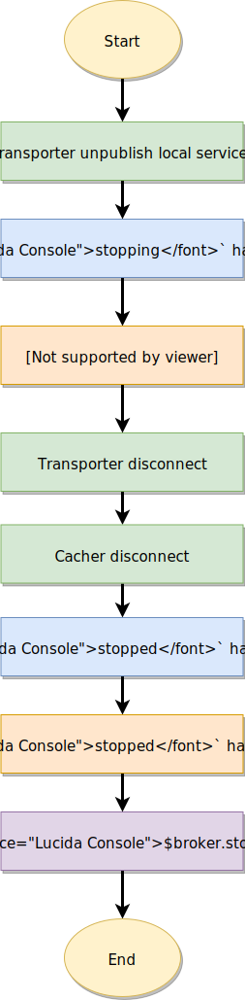

# Protocol 5.0 (rev. 1)

This protocol is used to communicate between the Moleculer nodes.

## Concept

### Subscriptions

After the client is connected to the message broker (NATS, Redis, MQTT), it subscribes to the following topics:

| Type                | Topic name              |
| ------------------- | ----------------------- |
| Event               | `MOL.EVENT.<nodeID>`    |
| Event (balanced)    | `MOL.EVENTB.<event>`    |
| Request             | `MOL.REQ.<nodeID>`      |
| Request (balanced)  | `MOL.REQB.<action>`     |
| Response            | `MOL.RES.<nodeID>`      |
| Discover            | `MOL.DISCOVER`          |
| Discover (targeted) | `MOL.DISCOVER.<nodeID>` |
| Info                | `MOL.INFO`              |
| Info (targeted)     | `MOL.INFO.<nodeID>`     |
| Heartbeat           | `MOL.HEARTBEAT`         |
| Ping                | `MOL.PING`              |
| Ping (targeted)     | `MOL.PING.<nodeID>`     |
| Pong                | `MOL.PONG.<nodeID>`     |
| Disconnect          | `MOL.DISCONNECT`        |

> If `namespace` is defined, the topic prefix is `MOL-<namespace>` instead of `MOL`. E.g.: `MOL-dev.EVENT` when the namespace is `dev`.

**Variables in topic names:**

- `<namespace>` - Namespace from broker options
- `<nodeID>` - Target nodeID
- `<action>` - Action name. E.g.: `posts.find`
- `<group>` - Event group name. E.g.: `users`
- `<event>` - Event name. E.g.: `user.created`

### Discovering

After subscribing, the transporter broadcasts a `DISCOVER` packet. In response to this, all connected nodes send back `INFO` packet to the sender node. From these responses, the client builds its own service registry. At last, the client broadcasts own INFO packet to all other nodes.


### Heartbeat

The client has to broadcast `HEARTBEAT` packets periodically. The period value comes from broker options (`heartbeatInterval`). The default value is 5 secs.
If the client does not receive `HEARTBEAT` for `heartbeatTimeout` seconds from a node, marks it broken and doesn't route requests to this node.


### Request-reply

When you call the `broker.call` method, the broker sends a `REQUEST` packet to the targeted node. It processes the request and sends back a `RESPONSE` packet to the requester node.


### Event

When you call the `broker.emit` method, the broker sends an `EVENT` packet to the subscriber nodes. The broker groups & balances the subscribers, so only one instance per service receives the event. If you call the `broker.broadcast` method, the broker sends an `ĘVENT` packet to all subscriber nodes. It doesn't balance the subscribers.


### Ping-pong

When you call the `broker.ping` method, the broker sends a `PING` packet to the targeted node. If node is not defined, it sends to all nodes. If the client receives the `PING` packet, sends back a `PONG` response packet. If it receives, broker broadcasts a local `$node.pong` event to the local services.


### Disconnect

When a node is stopping, it broadcasts a `DISCONNECT` packet to all nodes.


## Protocol messages

### `DISCOVER`

When the transporter established the connection with the message broker, it broadcasts a `DISCOVER` message to all other nodes.

**Topic name:**

- `MOL.DISCOVER` (if broadcasts)
- `MOL.DISCOVER.node-1` (if sent only to `node-1`)
- `MOL-dev.DISCOVER` (if namespace is `dev`)

**Fields:**

| Field    | Type     | Required | Description       |
| -------- | -------- | -------- | ----------------- |
| `ver`    | `string` | ✔        | Protocol version. |
| `sender` | `string` | ✔        | Sender nodeID.    |

**Example with JSON serializer**

```json
{
  "ver": "4",
  "sender": "node-100"
}
```

### `INFO`

When the node receives an `INFO` packet, it sends an `INFO` packet which contains all mandatory information about the nodes and the loaded services.

**Topic name:**

- `MOL.INFO` (if broadcasts)
- `MOL.INFO.node-1` (if sent only to `node-1`)
- `MOL-dev.INFO` (if namespace is `dev`)

**Fields:**

| Field                | Type       | Required | Description                                           |
| -------------------- | ---------- | -------- | ----------------------------------------------------- |
| `ver`                | `string`   | ✔        | Protocol version.                                     |
| `sender`             | `string`   | ✔        | Sender nodeID.                                        |
| `services`           | `object`   | ✔        | Services list. (\*)                                   |
| `config`             | `object`   | ✔        | Client configuration. (\*)                            |
| `instanceID`         | `string`   | ✔        | Instance ID                                           |
| `ipList`             | `[string]` | ✔        | IP address list of node                               |
| `hostname`           | `string`   | ✔        | Hostname of node                                      |
| `client`             | `object`   | ✔        | Client information                                    |
| `client.type`        | `string`   | ✔        | Type of client implementation(`nodejs`, `java`, `go`) |
| `client.version`     | `string`   | ✔        | Client (Moleculer) version                            |
| `client.langVersion` | `string`   | ✔        | NodeJS/Java/Go version                                |
| `metadata`           | `object`   | ✔        | Node-specific metadata. (\*)                          |

> (\*) In case of schema-based serializers, the field value is encoded to JSON string.

**Example with JSON serializer**

```json
{
  "services": [
    {
      "name": "$node",
      "settings": {},
      "metadata": {},
      "actions": [],
      "events": {}
    },
    {
      "name": "greeter",
      "settings": {},
      "metadata": {},
      "actions": [],
      "events": {}
    }
  ],
  "ipList": ["10.35.0.34"],
  "hostname": "moleculer-server",
  "client": {
    "type": "nodejs",
    "version": "0.14.0-beta3",
    "langVersion": "v12.10.0"
  },
  "config": {},
  "instanceID": "ee21e97d-9fd0-4d7e-a303-70b1605f477f",
  "metadata": {},
  "seq": 2,
  "ver": "4",
  "sender": "nodeID-1"
}
```

### `HEARTBEAT`

**Topic name:**

- `MOL.HEARTBEAT`
- `MOL-dev.HEARTBEAT` (if namespace is `dev`)

**Fields:**

| Field    | Type     | Required | Description                           |
| -------- | -------- | -------- | ------------------------------------- |
| `ver`    | `string` | ✔        | Protocol version.                     |
| `sender` | `string` | ✔        | Sender nodeID.                        |
| `cpu`    | `double` | ✔        | Current CPU utilization (percentage). |

**Example with JSON serializer**

```json
{
  "ver": "4",
  "sender": "node-100",
  "cpu": 13.5
}
```

### `REQUEST`

**Topic name:**

- `MOL.REQ.node-2`
- `MOL.REQB.<action>` (if built-in balancer is disabled)
- `MOL-dev.REQ.node-2` (if namespace is `dev`)

**Fields:**

| Field        | Type      | Required | Description                                    |
| ------------ | --------- | -------- | ---------------------------------------------- |
| `ver`        | `string`  | ✔        | Protocol version.                              |
| `sender`     | `string`  | ✔        | Sender nodeID.                                 |
| `id`         | `string`  | ✔        | Context ID.                                    |
| `action`     | `string`  | ✔        | Action name. E.g.: `posts.find`                |
| `params`     | `object`  |          | `ctx.params` object.                           |
| `meta`       | `object`  | ✔        | `ctx.meta` object.                             |
| `headers`    | `object`  |          | `headers` in calling options.                   |
| `timeout`    | `double`  | ✔        | Request timeout (distributed) in milliseconds. |
| `level`      | `int32`   | ✔        | Level of request.                              |
| `tracing`    | `boolean` | ✔        | Need to send tracing events.                   |
| `parentID`   | `string`  |          | Parent context ID.                             |
| `requestID`  | `string`  |          | Request ID from `ctx.requestID`.               |
| `caller`     | `string`  |          | Action name of the caller.                     |
| `stream`     | `boolean` | ✔        | Stream request.                                |
| `seq`        | `int32`   |          | Stream sequence number.                        |

**Example with JSON serializer**

```json
{
  "id": "41238213-da6b-4313-9909-e6edd0e40a96",
  "action": "greeter.hello",
  "params": {},
  "meta": {},
  "headers": {},
  "timeout": 10000,
  "level": 1,
  "tracing": null,
  "parentID": null,
  "requestID": "41238213-da6b-4313-9909-e6edd0e40a96",
  "caller": null,
  "stream": false,
  "ver": "4",
  "sender": "nodeID-1"
}
```

### `RESPONSE`

**Topic name:**

- `MOL.RES.node-1`
- `MOL-dev.RES.node-1` (if namespace is `dev`)

**Fields:**

| Field      | Type      | Required | Description                         |
| ---------- | --------- | -------- | ----------------------------------- |
| `ver`      | `string`  | ✔        | Protocol version.                   |
| `sender`   | `string`  | ✔        | Sender nodeID.                      |
| `id`       | `string`  | ✔        | Context ID (from `REQUEST`).        |
| `success`  | `boolean` | ✔        | Is it a success response?           |
| `data`     | `object`  |          | Response data if success.           |
| `error`    | `object`  |          | Error object if not success.        |
| `meta`     | `object`  | ✔        | `ctx.meta` object.                 |
| `headers`  | `object`  |          | `ctx.responseHeaders` object        |
| `stream`   | `boolean` | ✔        | Stream request.                     |
| `seq`      | `int32`   |          | Stream sequence number.             |

**Example with JSON serializer**

```json
{
  "id": "a4dd3ae5-2eff-4924-94bc-4acb8ac034aa",
  "meta": {},
  "headers": {},
  "success": true,
  "data": {
    "message": "Hello Moleculer"
  },
  "ver": "4",
  "sender": "nodeID-2"
}
```

### `EVENT`

**Topic name:**

- `MOL.EVENT.node-1`
- `MOL.EVENTB.<group>.<event>` (if built-in balancer is disabled)
- `MOL-dev.EVENT.node-1` (if namespace is `dev`)

**Fields:**

| Field       | Type            | Required | Description                         |
| ----------- | --------------- | -------- | ----------------------------------- |
| `ver`       | `string`        | ✔        | Protocol version.                   |
| `sender`    | `string`        | ✔        | Sender nodeID.                      |
| `id`        | `string`        | ✔        | Context ID.                         |
| `event`     | `string`        | ✔        | Event name. E.g.: `users.created`   |
| `data`      | `object`        |          | Event payload.                      |
| `meta`      | `object`        | ✔        | `ctx.meta` object.                  |
| `headers`   | `object`        |          | `headers` in event options          |
| `level`     | `int32`         | ✔        | Level of event.                     |
| `tracing`   | `boolean`       | ✔        | Need to send tracing events.        |
| `parentID`  | `string`        |          | Parent context ID.                  |
| `requestID` | `string`        |          | Request ID from `ctx.requestID`.    |
| `caller`    | `string`        |          | Action/Event name of the caller.    |
| `stream`    | `boolean`       | ✔        | Stream request.                     |
| `seq`       | `int32`         |          | Stream sequence number.             |
| `groups`    | `Array<string>` |          | Groups for balanced events.         |
| `broadcast` | `boolean`       | ✔        | Broadcast event                     |

**Example with JSON serializer**

```json
{
  "id": "e102630b-c702-4ff9-a0a1-52428395d57a",
  "event": "some.test",
  "data": {
    "name": "John"
  },
  "groups": ["greeter"],
  "broadcast": false,
  "meta": {},
  "headers": {},
  "level": 1,
  "tracing": null,
  "parentID": null,
  "requestID": "e102630b-c702-4ff9-a0a1-52428395d57a",
  "caller": null,
  "needAck": null,
  "ver": "4",
  "sender": "nodeID-1"
}
```

### `EVENTACK`

**_Not implemented yet._**

**Topic name:**

- `MOL.EVENTACK.node-1`
- `MOL-dev.EVENTACK` (if namespace is `dev`)

**Fields:**

| Field     | Type      | Required | Description                       |
| --------- | --------- | -------- | --------------------------------- |
| `ver`     | `string`  | ✔        | Protocol version.                 |
| `sender`  | `string`  | ✔        | Sender nodeID.                    |
| `id`      | `string`  | ✔        | Event Context ID.                 |
| `success` | `boolean` | ✔        | Is it successful?                 |
| `group`   | `string`  |          | Group of event handler.           |
| `error`   | `object`  |          | Error object if not success. (\*) |

> (\*) In case of schema-based serializers, the field value is encoded to JSON string.

**Example with JSON serializer**

```json
{
  "ver": "4",
  "sender": "node-100"
}
```

!!TODO!!

### `PING`

**Topic name:**

- `MOL.PING` (if broadcasts)
- `MOL.PING.node-1` (if sent only to `node-1`)
- `MOL-dev.PING` (if namespace is `dev`)

**Fields:**

| Field    | Type     | Required | Description        |
| -------- | -------- | -------- | ------------------ |
| `ver`    | `string` | ✔        | Protocol version.  |
| `sender` | `string` | ✔        | Sender nodeID.     |
| `id`     | `string` | ✔        | Message ID.        |
| `time`   | `int64`  | ✔        | Time of sent. (\*) |

> (\*) The number of milliseconds between 1 January 1970 00:00:00 UTC and the given date.

**Example with JSON serializer**

```json
{
  "time": 1567677050576,
  "id": "3e09738f-cedf-4985-85fe-344860c06cfd",
  "ver": "4",
  "sender": "nodeID-2"
}
```

### `PONG`

**Topic name:**

- `MOL.PONG.node-1`
- `MOL-dev.PONG` (if namespace is `dev`)

**Fields:**

| Field     | Type     | Required | Description                |
| --------- | -------- | -------- | -------------------------- |
| `ver`     | `string` | ✔        | Protocol version.          |
| `sender`  | `string` | ✔        | Sender nodeID.             |
| `id`      | `string` | ✔        | Message ID.                |
| `time`    | `int64`  | ✔        | Timestamp of sent. (\*)    |
| `arrived` | `int64`  | ✔        | Timestamp of arrived. (\*) |

> (\*) The number of milliseconds between 1 January 1970 00:00:00 UTC and the given date.

**Example with JSON serializer**

```json
{
  "time": 1567677050576,
  "id": "3e09738f-cedf-4985-85fe-344860c06cfd",
  "arrived": 1567677050577,
  "ver": "4",
  "sender": "nodeID-1"
}
```

### `DISCONNECT`

**Topic name:**

- `MOL.DISCONNECT`
- `MOL-dev.DISCONNECT` (if namespace is `dev`)

**Fields:**

| Field    | Type     | Required | Description       |
| -------- | -------- | -------- | ----------------- |
| `ver`    | `string` | ✔        | Protocol version. |
| `sender` | `string` | ✔        | Sender nodeID.    |

**Example with JSON serializer**

```json
{
  "ver": "4",
  "sender": "node-100"
}
```

## Graceful starting & stopping

### Start

The broker starts by establishing connection with the `transporter` (e.g., NATS server, MQTT broker). After successfully establishing the connection, it starts all services, i.e., calls service `started` handlers. Once all services have started successfully, broker publishes the local service list to remote nodes. Hence remote nodes will send requests only after all local service have started properly.

**Start lifecycle sequence**



### Stop

When broker is stopping, it starts by publishing an empty service list to all remote nodes. This is done to inform all remote nodes that the node and it's service will be shut down. Next, broker starts stopping all local services. After that, the transporter disconnects.

**Stop lifecycle sequence**



## Streams

While transferring streams, sequence number (`seq`) field is used to keep track of the chunks and their order. This is especially important in "multi-threaded systems" that can shuffle the packets before sending them. If packets arrive unordered they are stored in a pool until previous chucks arrive.
> The `seq = 0` is the first initial package and it has `params`, `headers` and `meta` properties. This package doesn't contain stream data.

## Disabled built-in balancer mode

When built-in load balancing mechanisms are disabled, the balancing is done by the brokers (e.g., NATS, RabbitMQ). This means that there are no local calls in actions and events. All requests are transferred to transporter that will be responsible for choosing the destination of the request and delivery of the message.

## Changes from version `4`

Removed schema-based serializers (ProtoBuf, Avro, Thrift)

**REQUEST**
- removed `dataType: enum` property
- new `headers` property

**RESPONSE**
- removed `dataType: enum` property
- new `headers` property

**EVENT**
- removed `dataType: enum` property
- new `headers` property
